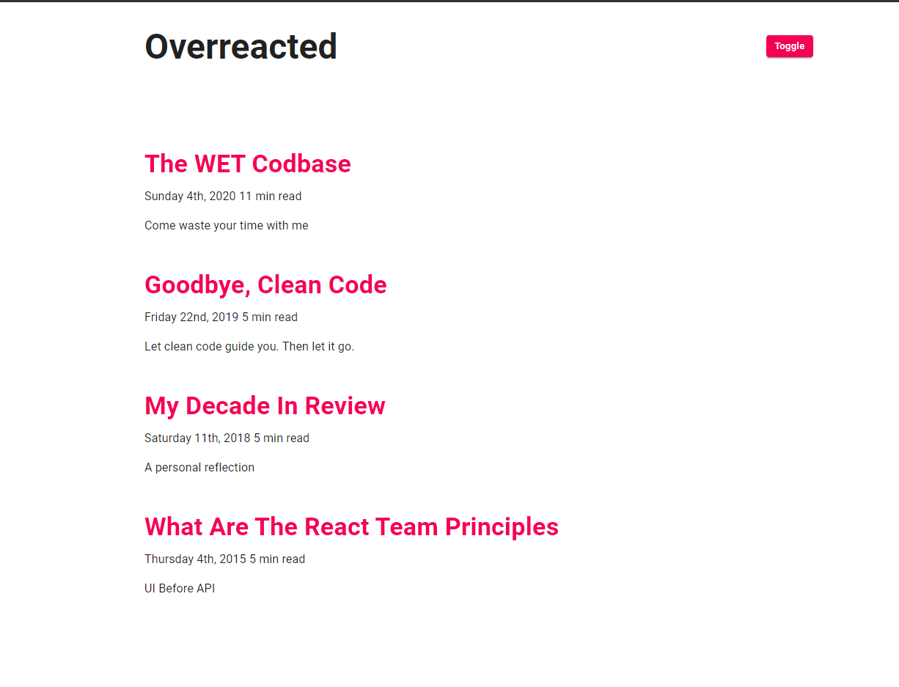

# Dark Mode
> Simple project which purpose is to show how we can use Dark Mode in very efficient way

## Table of contents
* [General info](#general-info)
* [Screenshots](#screenshots)
* [Technologies](#technologies)
* [Setup](#setup)
* [Features](#features)
* [Status](#status)
* [Contact](#contact)

## General info
My main motivation about making this project was to practice my react skills.

## Screenshots

## Technologies
* React JS - create-react-app
* Material UI
* Moment JS

## Setup
Demo : https://dark-mode-project.netlify.app/

## Features
* Toggling Dark/Light Mode

## Status
Project is: _finished_

## Contact
Created by [@Dan](https://www.linkedin.com/in/danail-kostov-ba95b81b3/) - feel free to contact me!