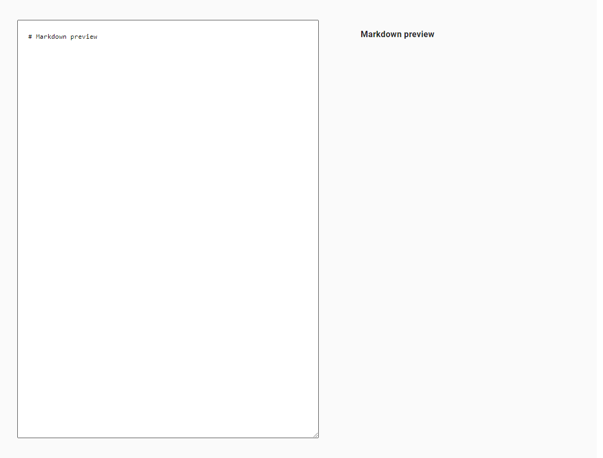

# Markdown Preview
> Instant preview of markdown files - type what you want to have in your markdown and in same time see the output!

## Table of contents
* [General info](#general-info)
* [Screenshots](#screenshots)
* [Technologies](#technologies)
* [Setup](#setup)
* [Features](#features)
* [Status](#status)
* [Contact](#contact)

## General info
My motivation for this project was just to practice in something more simple and in same time useful.

## Screenshots

## Technologies
* React JS - create-react-app
* Material UI

## Setup
Demo: https://markdown-preview-project.netlify.app/

## Features
* Output your Markdown

## Status
Project is:  _finished_

## Contact
Created by [@Dan](https://www.linkedin.com/in/danail-kostov-ba95b81b3/) - feel free to contact me!