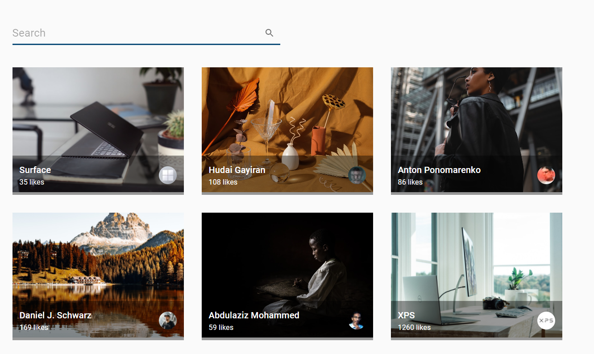

# Stock Photos
> Infinite image gallery using unsplash API!

## Table of contents
* [General info](#general-info)
* [Screenshots](#screenshots)
* [Technologies](#technologies)
* [Setup](#setup)
* [Features](#features)
* [Status](#status)
* [Contact](#contact)

## General info
My motivation for this project was to practice my React and API skills

## Screenshots

## Technologies
* React JS - create-react-app
* Material UI

## Setup
Demo: https://stock-photos-project.netlify.app/

## Features
* Search field
* Infinite scroll

## Status
Project is: _finished_

## Contact
Created by [@Dan](https://www.linkedin.com/in/danail-kostov-ba95b81b3//) - feel free to contact me!